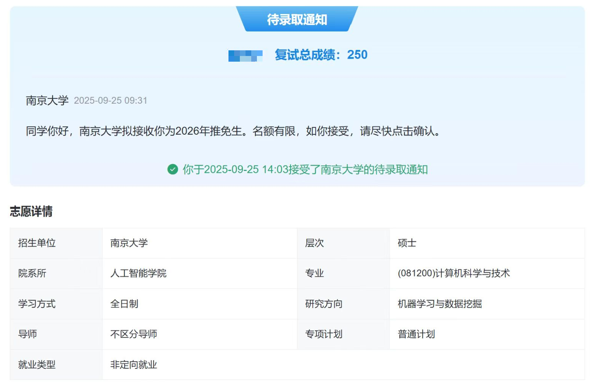
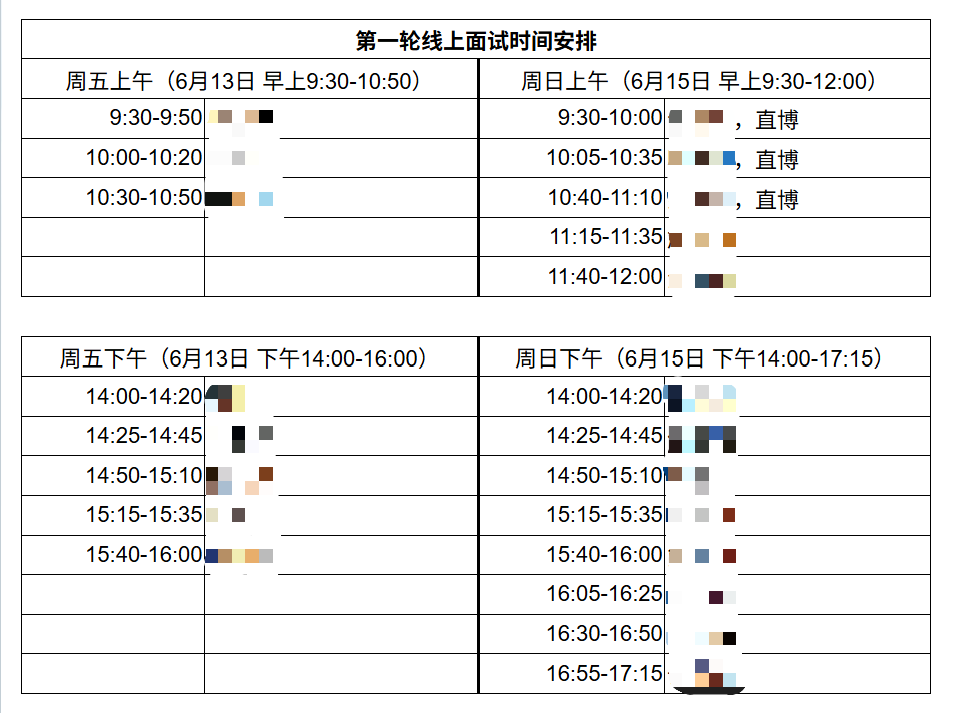
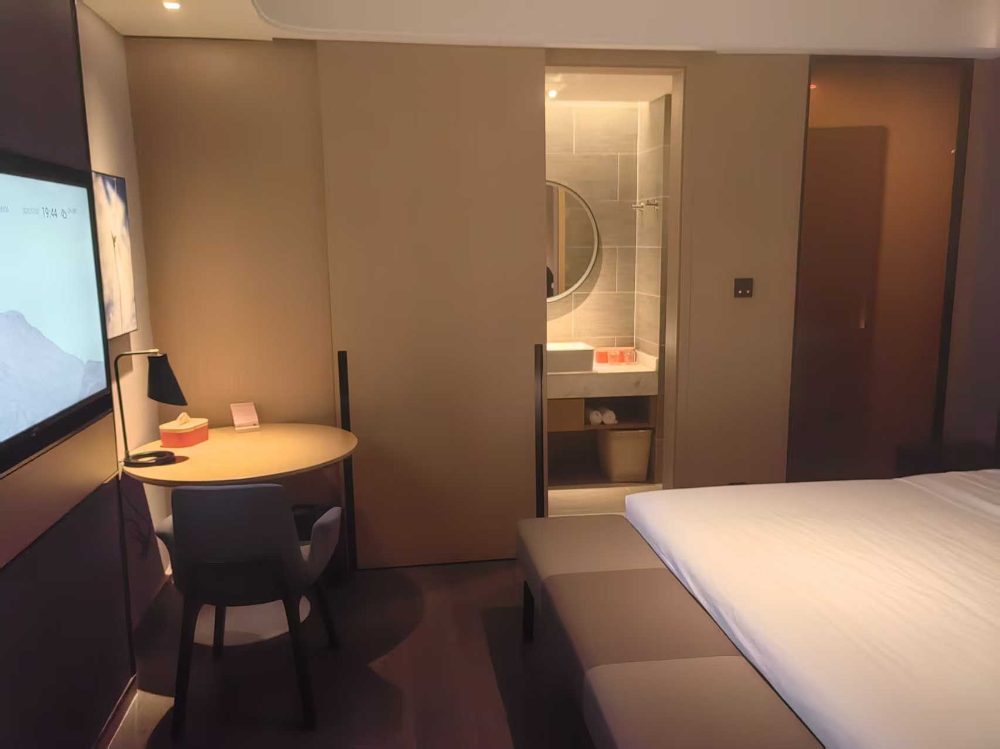
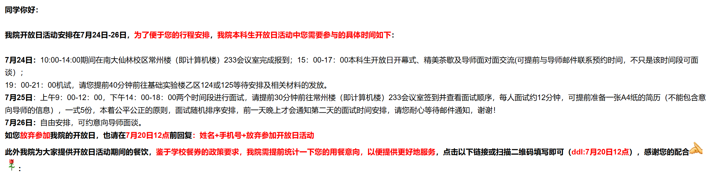
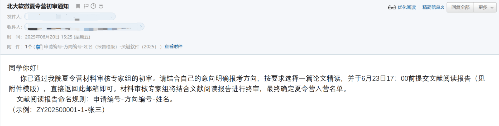
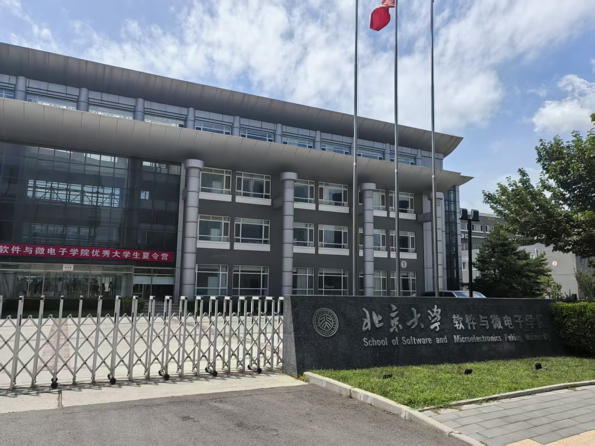
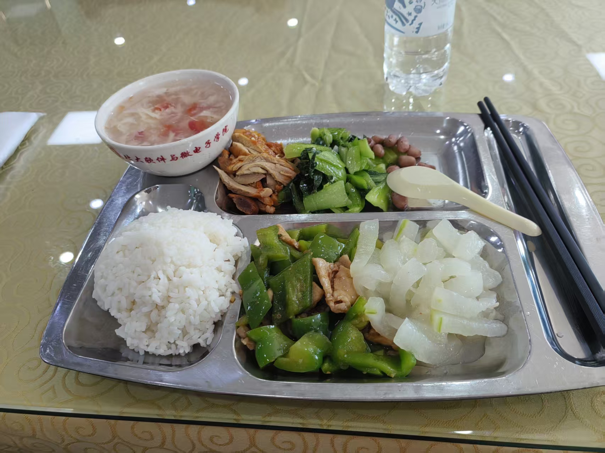
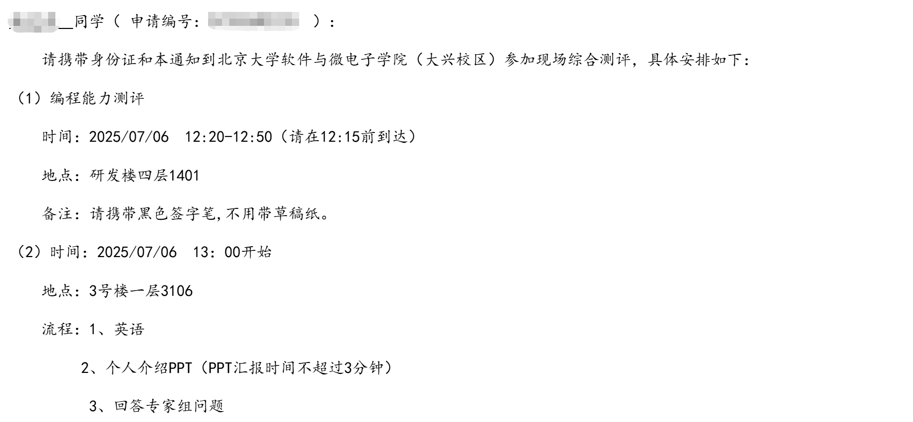

# 22级网安保研南大LAMDA经验分享

> 欢迎移步知乎帖子 [2025年（2026届）保研经验贴（南大LAMDA/北大软微） - 知乎](https://zhuanlan.zhihu.com/p/2005257673063556491)

# 一、个人情况

**学校：** 次九，网络空间安全

**排名：** 1/100+（1%）

**英语：** CET4-611，CET6-510

**奖项：** 国家奖学金×2，校一等奖学金×2

**科研：** NUS两段CV方向科研，保研时产出 CCF-A 三作在投

**竞赛：** 国家级大创优秀，美赛M奖，聊胜于无

**最终去向：** 南大LAMDA学硕

# 二、入营情况（时间顺序）

| 学校               | 类型 | 入营 | 优营     | 备注         |
| ------------------ | ---- | ---- | -------- | ------------ |
| 南大CS             | 学硕 | ✅️    | 宣讲营   |              |
| 浙大软件           | 专硕 | ✅️    | 放弃入营 | 大海营       |
| 北大软微           | 专硕 | ✅️    | ❌️        |              |
| 北大CS             | 学硕 | ❌️    |          |              |
| 北大智科           | 学硕 | ❌️    |          |              |
| 南大lamda          | 学硕 | ✅️    | ✅️        | **最终去向** |
| 上交CS             | 学硕 | ❌️    |          |              |
| 人大信院           | 学硕 | ❌️    |          |              |
| 人大高瓴           | 学硕 | ❌️    |          |              |
| 复旦CS             | 专硕 | ❌️    |          | 难以理解     |
| 港中文CSE提前批    | PhD  | ✅️    | 放弃入营 | 已有offer    |
| 清华网研（预推免） | 专硕 | ✅️    | 放弃入营 | 已有offer    |
| 清华软件（预推免） | 专硕 | ❌️    |          |              |
| 清深AI（预推免）   | 专硕 | ❌️    |          |              |

# 三、参营学校

## 南大LAMDA

LAMDA是南大人工智能学院下面的一个实验室，也是最大的一个，基本上整个AI院一半学生都是LAMDA的。LAMDA有一个单独的招生页面 [LAMDA2026](https://www.lamda.nju.edu.cn/recruit-2026/recruit-2026.html)，上面会详细写明导师情况以及报名截止时间，需要注意的是，LAMDA的面试时间在AI院的夏令营之前，需要先通过LAMDA实验室的面试，再拿到AI院的优营，才能获得入学资格（每年都有不少人挂在了AI院的考核上）。个人觉得很有意思的点是，LAMDA的简历要求的是带普通生活照的个人简历，这个可能需要单独准备一下。

报名的时候可以填三个老师，分一二三志愿，往年经验贴说有三志愿老师联系他的，但是我是只有一志愿老师联系了，建议最好还是按照心仪顺序排序。

### 一面

通过简历后，你报名的老师会给你发通知邮件，每个老师的面试时间都不一样，所以暂时没收到邮件的不用太着急（在小红书上看有人问一面通知发没发的时候我们组甚至一面都面完了...）。LAMDA的面试流程非常规范，考察知识很全面，基本上涵盖了后续夏令营中的所有可能的基础知识了，而且面试的学长都很友好，看你不会的问题会主动帮你跳过（据后续我导说，他们面试不是为了找你不会什么，而是找到你会什么）

一面是线上腾讯会议进行，时间大约20分钟，学生面，上来先做一个1分钟的自我介绍，然后四五个学长轮流对你提问，每个人会提问一个板块的知识点，我提问的问题总结在下面了，基本上涵盖全了：

+ **机器学习：**
  1. Flash Attention V1/V2 原理
  2. Attention 的计算方式
  3. KV cache 原理，以及为什么没有 Q cache
  4. Adam 优化器介绍
  5. Bagging 与 Boosting 的区别
  6. GBDT 的定义与原理
  7. SVM支持向量的定义、SVM 结果与全部样本相关还是部分样本相关、SVM 为什么要转为对偶问题（北大软微面试喜提原题）
+ **数学：**
  1. 特征值分解与 SVD 分解的定义，及其在机器学习中的应用
  2. SGD 用单个样本模拟总体期望的原理（大数定律）
  3. 中心极限定理的介绍
  4. 正定矩阵的定义
  5. 海森矩阵的应用
  6. 凸函数与强凸函数的区别
  7. 贝叶斯公式及其应用
  8. 先验、后验、极大似然估计的概念
+ **算法：**
  1. 快排的平均和最坏时间、空间复杂度
  2. 如何用两个栈模拟一个队列
  3. BFS/DFS区别
+ **项目：**
  + 这个根据你的简历项目来问的，由于我之前是搞CV的，就问了我siglip和blip2的一些原理。

一面大概是20进10，最终要2个硕士1个直博，竞争还是挺激烈的。

### 二面

一面后几天会发二面通知，需要去南大仙林校区线下参加，组内报销路费及住宿，住的是学校对面的亚朵，酒店环境非常好，早餐甚至有鸭血粉丝汤（这很南京）。

二面的形式是给两篇论文二选一，大概1周的时间，准备一个10分钟以内的简要汇报PPT，并复现论文中的关键算法。论文一篇是关于RLHF另一篇是online learning的，由于之前做过RL相关的工作所以我选了RLHF那篇。虽然标题看起来十分友好，但是论文中还是有相当多的数学推导过程，一周内完全理解这其中的证明过程还是很困难的，最后也是狂肝PPT到了面试前一天的凌晨。

面试是老师和学生一起面，先自己根据PPT汇报论文，然后会根据论文的内容来提问，只要认真看了论文大部分还是很容易回答的，比如说遗憾界（Regret）和最大化奖励的区别、某些符号是什么意思等等。除此之外还会考察一下你的科研经历和未来意向，这里不会涉及到太多基础知识，主要是了解一下你。由于我的简历上的生活照是大二的时候，老师还发出了灵魂拷问，问我怎么现在长胖了（谨防照骗）。

由于自己数学基础比较扎实，再加上确实也花了相当多的时间仔细准备了论文汇报，最后也是不出意外（有点惊喜）的过了。虽然但是，还需要准备南大AI院的夏令营，最后也是留在南京连玩带学地痛苦复习了十多天。

### 夏令营

夏令营报名的时候也分为简历筛和面试，即使通过了LAMDA面试，也有一定概率在简历关被卡rk筛掉，就很难绷。夏令营是不包车票和住宿的，也是常规操作了（但是来南大后课题组会给报）。一共是三天，第一天上午报道下午开幕式晚上机试，后两天面试。第一天的报道的时候会发一个小礼品（今年是小电风扇，对于南京酷热的暑期也是相当应景了）和四张餐券，下午的茶歇还是挺不错的（老传统了）。

**机试**

与往年不同的是，今年取消了笔试只有机试环节了（往年的笔试可谓是相当阴间，印象中有一年是200多道选择题），机试涉及的范围有机器学习、算法、pandas文件读写等等。机器学习部分准备可参考[头歌机器学习](https://www.educoder.net/paths/k8xqj4by)，算法部分可参考[LeetCode 热题 100 ](https://leetcode.cn/studyplan/top-100-liked/)。

机试是在机房进行的，在老师来之前机房门是不开的只能在门外站着，并且还是一个个点名点到才能进去，所以不建议提前太早来（半小时就行）。机房的电脑上常用的IDE和环境基本都有（vscode/pycharm/visual studio），没有OJ平台，最后提交的时候是把所有题目的代码和输出文件按照指定格式整理成压缩包提交到一个平台（感觉应该是脚本测评+人工阅卷防骗分）。

机试一共是两个大题，一道文件读写+算法，一道机器学习，每个大题四小问，一共2小时，满分150分。**推荐都用python做**（即使是算法题，不然别人都写完了自己可能还在调IO），机器学习部分**只能使用原生numpy库**，不能使用sklearn/pytorch/tensorflow等等。

+ 第一大题主要是文件读写和算法：
  1. 读取一个csv文件，进行异常值处理（格式不正确，缺失数据等等），然后计算均值方差，并将结果输出到txt文件。这一问一共有10个csv文件，并且此后每一问都会有10个测试点，指望手动处理不太现实，对python的文件读写要比较熟悉。
  2. 统计词频，实现TF-IDF算法。
  3. 算法题，最小编辑距离，leetcode hot100的原题，[72. 编辑距离 - 力扣（LeetCode）](https://leetcode.cn/problems/edit-distance/?envType=study-plan-v2&envId=top-100-liked)。
  4. 文件的最小编辑距离。二四小问实现起来有点复杂直接放弃了...。
+ 第二大题考察了logistics回归的原理和训练，提供给你整个代码的框架，需要完成函数补全：
  1. 完成TP/TN/FP/FN的计算。
  2. 忘记了。
  3. 实现softmax函数，需要考虑到数值溢出的可能（减去指数的最大值）。
  4. 使用梯度下降法进行logistics回归的训练，包括loss计算、参数更新过程，这里不会给你梯度的公式，最好提前复习好不然只能像我一样现场手推了。

**面试**

通知入营的时候会让你加一个QQ群，25号面试的人放一个群26号的放一个，可以提前确定你是哪一天面试的。面试前一天晚上才会发邮件告诉你是上午还是下午面，然后只有去面试当天去教室报道后才能看到具体排第几个（主打一个啥也不告诉你）。需要注意一点，面试的时候会统一在候场室等，会上交手机，**只能用没网的电脑和离线资料**，最好多带点资料去看不然次序靠后的话只能干等了。同时需要带至少4份简历，因为面试老师一共4个每人一份。

面试的时长硕士是每人12分钟，直博好像会长一些每人15分钟。这个时长是严格卡的，桌上会有个计时器，时间一到直接结束。面试一共有4个老师，每个人负责一个部分，流程为：

1. 英语面，一共有三个问题，我被问到的是：自我介绍、兴趣爱好、用过什么大模型。
2. 然后是针对基础知识的，基本都是机器学习里面的常见问题，可以参考西瓜书：
   + ROC曲线是什么，AUC值如何计算
   + 什么是正定矩阵，在机器学习中有什么用
   + 支持向量机有哪几种类型
3. 后续会根据你之前提到的知识以及项目来针对性提问，比如我简历上有强化学习相关的经历，提问了RL与SFT的区别、agent的定义等等。简历上的项目肯定是要对答如流的。

总体来说，南大的考核都偏基础和硬核，考察的知识范围比较广，需要有良好的机器学习基础。

## 北大软微

### 套磁和初筛

和北大其他计算机方向的学院一样，软微也是（超级）弱com，如果提前联系好了老师这些考核都相当于走形式。然而有趣的是，由于缺少更新，软微官网上很多老师的主页都没有，并且有主页的老师有的也没有联系方式，亦或是方向非常陈旧，因此套磁选择变得很有限。我在查看了网上的评价后，先给一位风评很好但是目前已经基本转行政的老师发邮件，没想到直接秒回，因此后续就没有再考虑过其他老师。

**需要注意的是**，软微大约是前两年开始，通过夏令营入学的学生免除学费（3W一年），但是不放实习需要参加科研，只会在研二暑假统一给三个月实习期（这个是入营后组内老师明确说的）；而预推免入学的学生需要正常缴纳学费，但是仍然和以前一样可以实习（传闻，不保真）。并且据往届经验，如果夏令营入营了但是没有优营，预推免再报软微的话会直接筛掉。**因此如果是像以前一样奔着北大title与放实习的，建议优先考虑预推免。**

夏令营初筛的时候应该是硬性卡rk3的，预推免卡rk5，因为后续我们方向的组内宣讲每个人自我介绍时都是rk123...，甚至rk3都很少。软微报名的时候需要选择你的方向，不同方向的招生是分开的，并且名额都是差不多的，所以建议避开热门的方向（例如方向4智能化软件工程，年年都是最热门的），AI方向的话可以考虑一下方向5领域智能软件（大数据机器学习、分布式智能运维等）和方向6领域智能软件 (智能计算与感知等)。

### 论文筛

通过初筛后，需要根据你的报名方向，从该方向的5篇论文中挑选一篇阅读并撰写成报告提交到邮箱，时间3天，页数和格式不限，能卷的话还是把报告尽量弄长一些（10-20页）精美一些。这一环节会筛掉一部分人，但是筛人原则比较随机，看群里有卷了50页报告被筛的，也有GPT大法过的。方向4在论文筛前还有额外的多轮机考，不过是线上开卷，结果应该仅供参考（我报名的是方向5，这个消息也是道听途说）。确定入营后，需要做一个3页的PPT介绍自己，发送到指定邮箱，之后面试的时候会让你对着这个讲。

### 笔试

在通过初筛和论文筛后，就可以线下去参营了，关键软件+微电子一共入营应该是300人，优营150人，优营率还是蛮高的。夏令营一共三天，第一天上午11:30-13:00报道，可以领取北大软微专属营服T恤，并提供餐票（伙食实在难以恭维），13:00-15:00是开营典礼和各组报告，每个方向都会有一个老师介绍一下自己组的情况。15:00-16:00按照不同的方向去对应的教室进行各组座谈，主要就是做一下自我介绍和向老师提提问，这个时候可以表现得积极一些，给老师留下好印象，后续面试就是这些老师了。

面试一共有两天，入营前会发邮件通知你是哪一天面试，以及上午还是下午。笔试在面试的时间前一点进行，上午面试的笔试就在早上8点，下午面试的就在12点。**关键软件和微电子的试题是不一样的（显然），但是关键软件不同方向之间的试题是一样的，每个时间段的试题都是不一样的，但是题型是一样的。**如果你是下午面试的，可以关注一下小红书上午面试同学的动态，看看今年的题型是什么。

今年题型有比较大的变化，往年一般都是算法题，今年有SQL和机器学习（完全没想到会考数据库），我收集到的部分题目如下：

+ 第一天下午：
  1. 给定一个数组，把它分成两个子集，使得两个子集的和的差的绝对值最小，C或JAVA语言实现（背包问题）
  2. 给了一个商品每个年份月份销售量的表，求连续三年同比且环比增长一定比率的商品（晕了，甚至不知道什么是同比和环比）。
  3. 用python实现LSTM（二连晕）
+ 第二天下午：
  1. 链表合并，C或JAVA语言实现
  2. 同样SQL
  3. python实现CNN

个人感觉笔试不是特别重要，老师也不是很看重，因为是手写代码没有OJ，并且笔试完待会面试的时候老师就会拿着你的笔试试卷来问你，没有时间阅卷，只要别写的太差就行，不用花很多精力准备（我就是天天刷leetcode，最后发现完全用不上）。

### 面试

面试也是按照方向来分的，顺序表贴在对应教室的门口，每人大概15分钟。进去后是一个大的方形桌，学生坐一边老师们坐另一边。流程为：

1. 英语问题（只有一个），这个不同组和不同时间段有所不同，大致有：1min自我介绍、最喜欢的名人、兴趣爱好。
2. 拿着你刚才笔试试卷跟你聊聊，问问你这个怎么不会啊，看的出来你的pytorch用的很好啊等等。
3. 花三分钟时间讲讲之前提交的3页自我介绍PPT。
4. 专业知识问，有个老师会拿个三个问题，问你抽哪一个。我们组的1号问题是如何缓解梯度消失，3号问题是SVM为什么要转为对偶问题（很不幸的是我抽中了3号问题，很巧的是这个问题之前面南大的时候已经问过了）。
5. 之后就是项目提问，让你详细介绍一下自己的项目都干了什么等等，因人而异。
6. 中间可能会穿插着各种奇怪的问题，比如有个老师问了我”你觉得NUS的学生和北大的学生哪个更优秀“。

面试完后第二天如果有老师看上你了会主动打电话联系你，大概1周左右出优营名单，如果没收到消息估计比较难优营了。面试的时候连着几号同学的问题基本上很像（尤其是英语问和专业知识问），前面的同学面试完后出来可以问问。

# 四、未参营学校

## 清华网研

清华今年改革取消学硕了，只有专硕/工程硕博/直博，并且取消夏令营只有预推免。网研院也是弱com，据我联系的那个老师说，每个老师都有推荐入营的名额，因此报名前最好还是能套着老师，硕士入营后就各凭本事了。后续出入营结果的时候我已经拿到了LAMDA的offer，也就直接放弃入营了。

## 上交CS

上交CS硕士竞争还是太激烈了，我们学院的两个专业的rk1都没有入CS的营，但是网安学院的营特别好入，很多CS学院的老师在网安学院也有招生名额，可以看看心意导师在网安有没有名额，然后报网安的营错位竞争，并且后来据我室友问的老师，甚至网安学院**专硕**优营入学也可以选CS的导师。

## 港中文CSE提前批

港中文还是一如既往的看中国奖，我是完全没有套磁但是也入了营，不过通过committee面试≠offer，后续还是要联系老师。面试地点三选一：zoom线上/深圳/香港，全英文面试。因为是第二批出入营结果的时候也是有offer了，遂放弃。

# 五、感想

回头看这一路，其实并没有想象中那么热血。更多的时候，是疲惫、犹疑，是在一次次不确定中反复权衡，甚至短暂地怀疑过自己。有人说：“走得慢并不可怕，怕的是停下来。”这条路并不公平，也从不温柔。背景、运气、时机，很多因素并不掌握在我们手里。但至少，是否认真准备、是否忠于内心的选择，是我们可以决定的事。“追风赶月莫停留，平芜尽处是春山”。你要走的路，本来就不必和任何人一样。

最后，想真诚地感谢一路上支持和帮助过我的老师、朋友和同学，也感谢那些素未谋面却愿意分享经验、回答问题的人。很多看似微不足道的善意，在回头时却照亮了整段旅程。

愿所有心中有梦的人，都能鼓起勇气向前；
愿努力终有回响，山海皆可抵达；
祝福大家，终能去到自己想去的地方。
