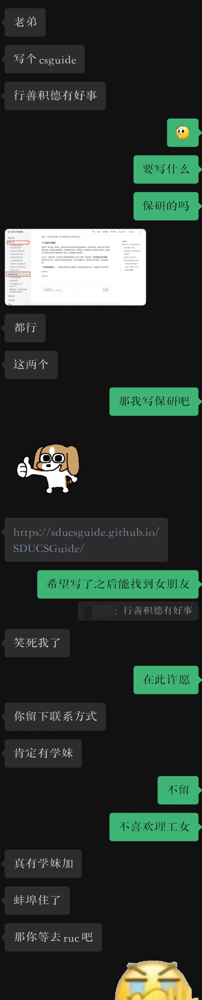

# 22 级泰山学堂保研感想

## 个人 BG
- rk：3/22；
- 竞赛：ICPC 区域赛金牌；
- 科研：一篇 CCF-A 会议，学生一作；

## 夏令营、预推免情况
| 学院           | 学位 | 入营 |   offer       |
| :--------------: | :----: | :----: | :------------: |
| 北大计算机学院 | 直博 | √    | √ | **上岸** |
| 人大高瓴 | 直博 | √    | √            |
| 上交计算机学院 | 直博 | √     | √             |
| 浙大计算机学院 | 直博 | √     |   中途放弃          |
| 上海人工智能实验室   | 直博 | √    |  √    |
| 自动化所       | 直博 | √    | 放弃参加 |
| 复旦计算与智能创新学院  | 直博 | √    | 放弃参加|
| 清软、贵系   | 直博 | ×    |× |

## 北京大学计算机学院
纯弱 com，必须要提前联系老师，老师会帮助你入营。考核有机试和面试，机试在北大的刷题网站 poj 百炼上进行，一共 8 道题左右，题目大约有一半是百炼原题，基本都是简单题，所以可以提前练习一下，刷个几百上千道足矣。面试是自我介绍 + 翻译一段英文 paper。是否获得 offer 完全取决于导师，与你的笔试面试基本无关，但不排除某些导师想参考笔试面试的情况发 offer 的可能。

## 人大高瓴
2025年还是强com，不需要提前联系导师，不过提前和导师聊聊也不错，也可以增加你对组里情况的了解。考核分为笔试和面试，笔试考数学题（选择）、数据结构题（填空和大题）、手写算法题、机器学习题（选择）、英译中。备考建议刷一下 408 王道数据结构，尤其是学堂的同学，因为考的数据结构跟学的数据结构差距还是很大的。数学题好像是往年的考研题。面试考算法题、数学题和英文对话。面试还有对过往科研经历的介绍。

考核满分 200 分。CSP 大于 300 可以加 10 分。事后看来这 10 分的作用还是非常大的。

## 上交计算机学院

入营强 com，拿 offer 需要和导师达成双选。上交计算机一般只给学堂第一名入营，我是第二天被导师海底捞入营的。直博只有面试，就是介绍简历，回答数学题或算法题，会让你用英文回答算法题。上交计算机基本入营及优营，但是拿到 offer 得等到九月左右和导师双选之后。

## 浙大计算机学院
弱com，需要提前联系导师。考核就是做导师的布置的 project，offer 取决于导师愿不愿意给你。战线很长，可能好几周。我当时拿到高瓴 offer 后就提前 quit 了。

## 上海人工智能实验室
夏令营前有位老师给我发邮件说想让我过去，于是就报了一下。考核有机试和面试。机试是牛客选择题和算法题，面试是介绍简历。
最后拿到了和复旦的联培，不过我没去。

## 写在最后
写下这句话时，我正坐在海淀出租屋里的桌子前，明天就要接受某大厂的实习面试，心中也一样充满着迷茫与无助。好快呀，转眼间就要本科毕业了。回想着刚入大学时的情景，回想着考入学堂的喜悦，回想着大一的智能小车大作业，回想着对爱情的憧憬，回想着和舍友们通宵复习的忙碌，回想着 225 学堂实验室的欢声笑语，心中还是有些许不舍（T_T），大抵是青春散场前最后的阵痛吧哈哈哈。人生海海，山山而川。还是要相信且坚信，前途自有光明万丈！

最后致谢一下 21 学堂的 Jo，看点开心的：

