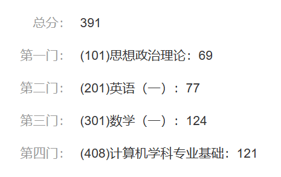
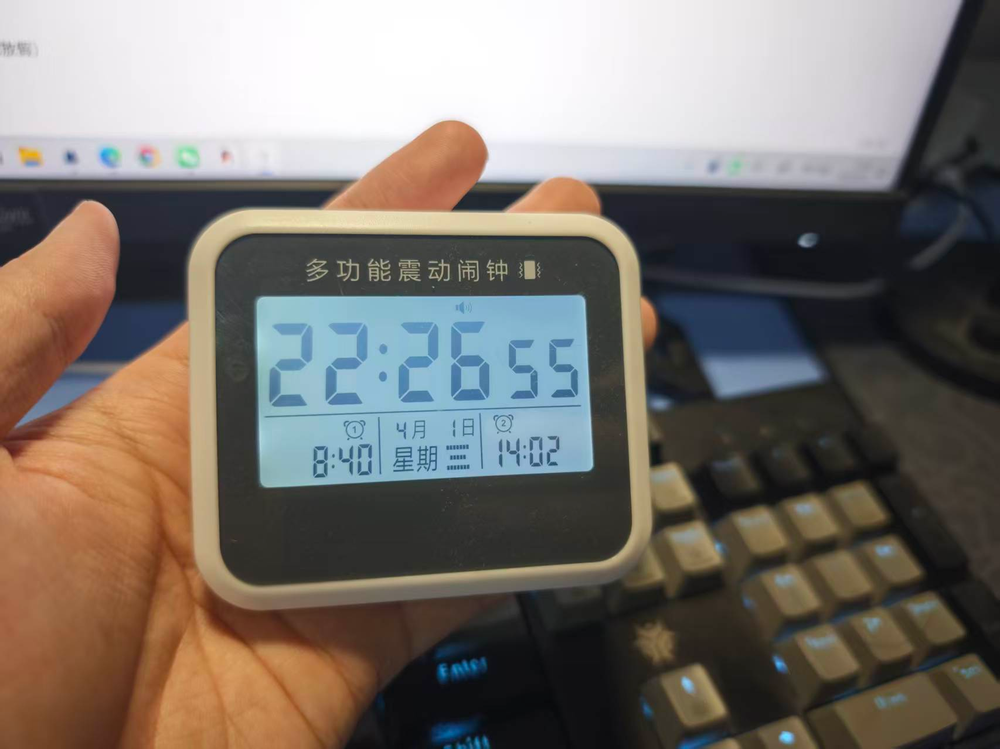

# 嗨，学弟学妹们好

我是20级计科人工智能专业（好像现在已经没有了哈）的老学长，现在在北邮读研二。

能给母校做些贡献我感觉非常兴奋，虽然是微不足道的一点点。我太爱山大了，我在离开山大几年后才意识到这一点。

北邮考研11408，总分391。

<figure><figcaption></figcaption></figure>

我在整个本科期间比较混，远远称不上什么大佬。我一直（幻）想打数学建模比赛保研，结果打了两年才混了一个省三，CSP竞赛第一次打甚至没到200分，专业课知识又几乎没怎么学会。大三陆陆续续开始准备找工作时发现自己的能力捉襟见肘，招聘手册里提到的要求我连看都看不懂。

虽然身无长物，但好在作为做题家是合格的。我相信我，一个平庸的人，考研成功的经验，对绝大多数学弟学妹有参考价值。

## 起床焚决

考研之前以为最难的科目是数学，不然也是408，开始准备才知道都不是，考研最难的科目是起床。

这就不得不提我的起床独门绝技了。

道具一：闹钟。不是手机闹钟，就是普通闹钟，你大概是没有的，可以去买一个电子的，很便宜。

<figure><figcaption></figcaption></figure>

道具二：手机，也用来定闹钟。

举个例子，你如果要7：20起床（这样可以八点到图书馆），那么将你的小闹钟设置为7：19，睡前放在枕边，手机闹钟设置为7：20，睡前放在**任何你在床上够不到的地方**，最好就是放在桌子上充电。

早上7：19，闹钟响起，这时候为了防止床下的闹钟把舍友全都叫醒，你不得不一骨碌滚下床去。当你下床按死闹钟后，基本就已经不困了，就算困，管住自己不要再上床也比起床简单太多了。

当然，我是为了防止自己玩手机才把手机放床下，闹钟放床上的。管的住手的同学也可以反过来。

## **初试各科经验分享**

不建议大家只看学习时间，**学习应当是任务导向的**，比如在某日刷多少课或者试卷，在某某日之前做完多少习题，多久之内掌握某知识点。学习时间仅供参考。

**在暑假之前**，我每天的学习时间平均下来可能还**不到6个小时**（惭愧），早期甚至可能只有4个小时左右，主要是压力还不大，经常偷偷给自己放假，晚上在图书馆坐到九点就回宿舍了，每天不是早上睡懒觉就是中午睡懒觉，属于是暴风雨来临前的舒适了。

在临近暑假的某一天，惊觉自己的进度怎么这么慢。好多同学专业课二轮都开了一半了，我怎么第一轮还没结束！

不能再这样堕落下去了！

暑假两个月（回家了）每日平均学习时间：**6-7小时**（还是经常给自己放假）

9-10月每日平均学习时间：**8小时**左右

11月每日平均学习时间：**9小时**左右

12月每日平均学习时间：**7-8小时**。压力巨大精神状态不甚稳定，感觉再这样下去影响备考状态，所以经常心安理得地赖床睡大觉。

我觉得最后时间好好休息是很重要的，准备的差不多的话一天八小时也已经不错了，但多余的时间最好睡觉，少打太上头的游戏，更不要熬夜。不要拿这么重要的事开玩笑。

**以下记录落笔于2024年，可能有部分内容不符合当下实际，学弟学妹仔细甄别。**

### **数学**

数学是最早开始准备的科目，从3月份就开始了，在开始复习专业课之前，每天大部分时间都在学数学。在**4月**多刷完了张宇的基础课程，开始做武钟祥660题，**7月初**刷完了一整套660（太折磨了，啥也不会）。之后就是很长的强化阶段，刷张宇的强化课程，同时兼顾刷1000题，一直做到了**10月**。

注意，我的进度其实是比较慢的，如果可以的话最好还是快一点。

其实一直到这个时候我都感觉自己的数学漏洞很多，如果你也这样的话，放轻松，**大部分人到这个阶段的数学都达不到自己想象中的水平，不要慌**，接下来才是主菜。

开始一心刷题！

**10-12月初**，我把09年到22年的所有真题刷了一遍，每套卷子要一口气做完再对答案，最好还能算算分。之前大家遇到什么做不出来的题目潦草反思一下也就算了，但是真题阶段**一定要认真反思**。这个阶段才是数学能力真正开始聚合提升的阶段，除了直到考研都不打算做出来的题目（比如中值定理大题），其他不会的题、做错的题一定都要记在错题本上。每套卷子在哪一章的知识点出错了也都要记录一下，回顾的时候会帮你找到弱点。比如，如果我当时没有记录自己错题章节的话，我自己都不会发现自己多元函数微分这一章学的很差（原以为很简单的）。

**12月初到考试**，更为重要的模拟卷阶段。其实流程和真题阶段差不多，也是需要认真反思。这个时候大家就可以留题准备整套模拟考试了，就和高中模考一样，一门课一套卷子，最终算算总分。**如果到这个阶段的时候你还觉得水平欠缺还是不要慌！**这个阶段认真反思也是可以带来大幅提升的，我本人感觉数学提升速度最快的阶段反而是最后的模拟卷阶段。

### **英语**

开始得早，但是强度低一点。在开专业课之前英语就是数学的中场休息，时间主要花在背单词（我用的《红宝书》）上，还有静姐（田静）的每日一句也是值得早期花时间的。暑假前后开始做真题我认为就来得及，**记得最好留出最新几套题目不要做，12月当模拟题**。英语复习是个Long Run，上述流程一直持续到考试就好了。多积累总是好的，但也不用太死板，某一步完成的不好也不影响考试看懂题目。

少相信什么阅读理解技巧（你读中文文章有什么技巧吗？），背单词，想办法看懂文章是唯一出路。如果你对自己的英语水平不是很有信心，你可以**开始准备之前就看一眼英语阅读理解的文章**， 如果生词很多的话，背单词的任务就一定要重视，**懒惰是英语差生的唯一原罪**。

**强烈推荐“不背单词”这个APP！！可以导入《红宝书》来背，如果不是12月才发现这个软件，我可能能真的背完整本单词了。**

### **政治**

很喜欢某考研公众号的一句话，流量高不代表更重要，政治就是这样的科目。

有些夸张的大哥，暑假之前甚至三四月份就开始准备政治了。如果你和他们一样被早早带着开了政治，认真地背诵了这那老师300页的背诵手册，那我建议你不要告诉别人，不然别人总结自己为什么考高分的时候你就要成为反面教材了。

我九月开始复习，还好开始的不早，最后甚至感觉九月都早了。政治老师们发的背诵手册里包含了考纲里的所有内容，**不是因为所有内容都重要！！**敢因为考试不重要就删掉内容是要犯ZZ错误的（这是可以说的吗），但是这不代表你就需要傻乎乎全背一遍了。

因为我开的时间早，看了一遍徐涛老师的基础课（啥也没记住）再简单看看肖一千的选择题（也没记住啥，还没做完）。

**！！注意，上述两步实际上无关紧要，别犯轴！！**如果你觉得时间不够了，十一月多了还没怎么看政治，就别再傻乎乎按着步骤来了，这两步及其耗费时间且**信息密度极低，考试用上的概率极小**。

我**11月下旬**开始看腿姐的强化课视频，仍然建议别犯轴，时间多的话可以照着她的手册或者肖的手册背一背，**时间不够的话简单看一遍就行了**，甚至不看手册只看课程也不是不行。在这个时候你可以找个考研**刷选择题的小程序**刷一刷题了，很有用，而且吃饭的时候可以做，不花时间，很建议。

我大概**12月4号开始看**救了我政治的**肖四肖八**，考场上看到题之后感觉我真得给肖老爷子磕俩响的。如果你真的一点时间都不能多拿出来了，**背完两本书的选择题和肖四的大题是底线了**。我直到考试前一天晚上还肖四大题，第二天早上发现头天晚上背的今天直接拿来用了，笑死。

### **专业课**

我从四月份开始准备专业课，暑假前其实还是以数学为中心的，从暑假开始逐渐增加专业课的复习权重。过了九月就基本上把408复习和数学摆在同等重要的位置上了。

王道的四本课本我完整过了有大概四遍，前期一边看视频课一边看书做课后题，后面不看课了就干看书和练习题，一页一页翻着看。408信息量太大太零碎，我是想不到有什么办法比多看几遍书更有用了。

408很重要，但是我好像也不知道还能给大家分享什么技巧了，毕竟不像数学，408多看多记就能考高分，也不像英语需要积累那么久，记得多看书！

**建议大家和英语一样，做王道课后练习时留出最新几年的真题，拿来模拟，不过不要留到最后哈，每套真题也要认真过好几遍，尤其最新的题。**

## **复试经验**

网上关于复试的经验已经很多了，我就不多讲了。如果一些划定考纲的内容不会，网上很多考研复试资料，红果研一类的大机构甚至会针对单个学校出资料，可以去了解一下。

如果有老师问你，你最擅长的是什么科目，你不妨想一下Ta现在想听到的是什么答案。她是更想听到你说你精通操作系统和计算机组成原理，还是想听到你有Ta研究方向的基础？都考408了，谁不能说自己擅长那几门课？面对现实，你初试甚至本科期间学的那几门传统计算机的课程几乎不会让你有任何优势，没准还会让你看起来像个做题家。一定要在简历和面试中突出自己的竞争点，比别人多会的那点东西一定要抖搂出来。哪怕你真的没有什么优势，初试到复试时间两个多月，这一点时间完全够你人工智能/大数据/云计算/现代数据库技术入门了，会点皮毛就可以说自己会不少了，谦虚的性格千万别用在这种时候！

还有一点，单纯是我的经验，像毕设一类的必问的问题，最好要准备两份回答，一份是长而详细的回答，为的就是在时间充裕的情况下让老师深入了解你的项目细节，另一份则是短篇，如果时间不够用了就拿出这个来。我面试前根本没想过回答问题还有时间不够这一说（别的面试组也没遇到这个问题，就面我的几个老师好像不是很有耐心），还没切入正题就被打断下一个问题了，相当吃亏。

最后一个点是信息差，强烈建议大家去水水各种群（甚至机构群都可以），可以的话social一下。我靠临时结交北邮本校的同学，早于所有人获悉了北邮复试科目变化的通知，比别人省了不少时间。

还有选老师的事，也要慎重慎重再慎重，摊上坏老师之后每天被PUA、抑郁、甚至干傻事都是常有的事，选老师可是比复习更重要的事。

## **最后几句话**

其实24年考完时我感慨万千，让我当时跟大家讲的话我能给大家讲上一大堆。但现在回过头看，好像也并不是多么大的坎，多么了不起的成就。

总有人会落榜的，落榜的人也不会死。

我明白大家怕什么，怕考不上的话就要面对自己一直在逃避的那件事：工作，成为社会的一部分。有的人为了逃避这件事会三战甚至四战，整个人生最能干、最有活力的日子都在准备一场不知道通往何方的考试了。

别想太多，你有勇气开始考研，自然也会有勇气面对生活，面对失败。

听我说，你已经准备好了，你只是自己还没意识到。

你只需要勇气。

好吧，还需要一点运气。

那就祝大家都有好运吧，至于你的勇气，你早晚会找到它的，我相信山大的学弟学妹。
