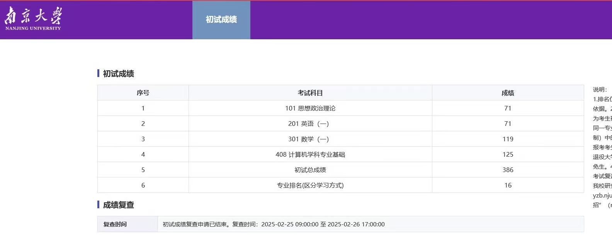

# 21 级南京大学计算机学院 11408考研经验分享

 

#### 写在前面

（临时起意，帖子中可能出现的错误还请海涵）

对本经验帖不必抱着学习的心态阅读，你可以在累了or迷茫的时候，当成一个小故事去看看。每个人都有独属于自己的学习方式，我跟的老师的讲课风格不一定适合你，我的学习时间安排也不过是基于当时的实际情况。提醒一下，从这里开始就可以跳过，只看你感兴趣的部分了。

本来不打算写经验帖了的，因为已经有很多优秀的学长学姐（尤其是南大）分享了他们的考研经历，我的经历和他们相比，足够平淡。但最近有几个学弟学妹通过其他方式联系到我，想了解关于初试课程学习和南大考研复试的情况，那就在这里提供一些我备考的经验教训还有些不成熟的小建议，仅供参考。

 

#### 为什么考研

先说一下我为什么考研吧。我本科在计科专业，前六个学期绩点排名大概在20%左右，刚好保不了研，只不过我最开始也没打算读研。本来的想法是看本科几年找到一份自己感兴趣的事情，早点工作。但到大三下学期到五月份了，看到身边朋友都有了自己的计划，而我那时还是不清楚自己到底想干什么，抱着不知道干什么的时候就去读书的心态，开始了考研之旅（至少此刻，我觉得当初的选择是正确的）。

 

#### 择校

我的择校逻辑很简单，我最初选择考研的时候就pass了清北（我怂）。因为本身就是山东人，城市选择还是在山东附近。最初考虑过北航、东南、南大还有咱山大。由于当时北航可能考自命题，我觉得挑选自命题资料的这个过程太耗神了，就pass掉了北航。剩下的也就南京的两所和母校。怎么说的，虽然我不敢报清北，但我又觉得考都考了，不如考个更厉害的，要不也对不起姐的努力。再加上我印象里，当时南大计算机是A/A+学科，东南和山大B+（印象里好像，啊啊啊啊记错了别骂我），最终就选择了南大。（但我还是怂的，不敢报学硕，最后报的专硕，所幸两者都考11408）。

上面的择校思路仅供参考，其实我择校的时候没咋关注往年的录取信息，也完全没考虑学校的考研热度，甚至刚开始连学硕专硕都分不清，完全放弃了博弈，这一点很不可取（我同学都说我这种属于考研野战军）。但其实这样也有好处，我完全排除了外界的干扰，所以我更加坚定自己的选择，无论结果是什么，我都不会后悔。

 

#### 初试准备

因为复试都有保密协议在，很难找到具体的资料，所以复试很看运气（hhh现在身边的朋友常说，南大喜欢运气好的孩子）。现阶段能做的就是把初试分提的足够高。

先说下我初试的情况吧。我考的是11408。总分386。具体分数如下：

<figure><figcaption>
初试分数
</figcaption></figure>

##### 408

**基础阶段** ：反正408基础课首选王道。这里要特别提一点，我计算机网络跟的是b站的湖大教书匠。个人认为讲的不错，节奏很好，大家可以和王道对比对比。整体的学习过程是这个样子：五月份开始听基础课，到七月初结束基础部分（我本科时候专业课成绩还不错，可能基础好点？基础部分学慢点也没事～）。 听完课我会做王道课后题，当时我没有解答题和选择题的概念，一股脑全做了。。。。。。大家这里可以做筛选。其中具体学习的顺序我不太记得了，但我记得我不是最后学习的计网。因为我觉得计算机网络是最需要反复记忆的（别的科目带点理解会好记忆很多），所以我选择早一点开计网，这样可以重复复习更多次。

**暑假** ：由于六月份准备期末考，复习的进度很慢，导致到七月过完一遍基础后，发现前面学的全忘了。我就重新刷了一遍王道课后选择题。这遍刷题是一个单元一个单元进行的，在刷每个单元的题之前，我会先把这个单元的基础知识回顾一遍，整理成思维导图，这个有点费时间，但我觉得很有用(思维导图当时毕业的时候还在二手群里出的来着，后来被一个学妹收走了，其中计组送给我的好朋友了）。这个过程持续了一个暑假。

**九月份开学后** ：由于我整理了思维导图，后面我每天早上快速复习一到两个单元的知识，进行滚动式复习。这样知识点复习的次数比较多也就记得比较牢了。由于前面基础打的比较牢，我强化的课就没怎么听，就选择性听了王道将算法的那部分强化课，然后把常考的代码模版整理出来。真题我从十月下开始刷，当时差不多两天一套（只算选择题得分）。刷完真题后，我就抽时间阅读了一下课本（如果时间来不及，这个过程可以忽略，个人感觉效果不大）。我中间还做了几套王道的模拟题，我做模拟题是不算分数的，主要是为了训练题感。十二月份再次回归真题和王道书，查漏补缺。

 

##### 数学（个人不太擅长，参考性不大，可跳过）

课程：和408同步时间，五月份开始基础，七月份开始强化。高数我主要是跟的武忠祥，一些我掌握不太好的知识点我就去看看张宇的。要是跟张宇的话，可以三科都跟他。我线代跟姜晓千，概率论跟李良。这里推荐一个宝藏老师——周洋鑫，可以去听听他的课，如果觉得合适，也可以全程跟他，我后期报名了他的冲刺课，感觉挺有用的。

题目：我数学刷了很多题，660、880、1000、330等，市面上大多数练习册我都买了，我的建议是不用刷这么多，选择两本即可，更推荐880。真题从十月份开始刷，可以多刷几遍。后期模拟题出版了就开始刷模拟套题，这个阶段要注意心态，真的会崩溃，建议不要把分数看的很重要（这很难做到）。我刚开始刷套题时，总分甚至不过百。。。。。。

 

##### 英语

25年的题目，我只能说多背单词吧。我用的是不背单词app和红宝书（乱序版）。

这里就简要说一下我上的课：我打基础的时候还跟了田静（笑死，现在估计查无此人了）；阅读只听了唐迟的基础课；后期完型听易熙人（往年的课）；新题型跟的一个小众一点的老师，新东方的马天艺；翻译听唐静；写作跟的周思成。

 

##### 政治

政治九月中旬开的。我当时跟的腿姐技巧班，基本上我会在图书馆闭馆回寝室后，听政治课磨耳朵。25年政治比较特殊，考这个分数运气占很大一部分。

肖老师还是很权威的，但作为考数一和408的考生，我觉得刷1000题对我们来说太奢侈了，我没咋写。我最后也只刷了8套卷和4套卷的选择题，没背大题，也恰好没考到。时政背的是腿姐的课附带的资料。

 

#### 复试tips

由于保密协议，我不能透露过多，这里只是一些个人感受和一些小建议。

复试挺难的，但也不用太担心。我本科是三无选手，但我初试占16，复试完总成绩占第8。所以在有效排名的前半部分，不用太焦虑，正常学就好。

复试分为：笔试+机试+面试。其中笔试考离散数学和编译原理。机试也可以说是top级的难度。面试双盲，特别公平，本科学历背景在面试的时候几乎没有任何帮助，在找导师可能有点帮助。

这里要特别提一点，其实25年南大计院初试炸了，但能看到的信息上计专的分数线不是特别高，这是因为他复试前临时加了30个卓越工程师名额，才把分数线拉回来。所以如果初试排名不是那么理想，也要积极准备复试，临时加名额是南大的基操。

还有25年，也是考前一周复试细则出来才通知加了机试+面试总分的斩杀线。我当时人都快疯了，因为最初我是抱着放弃机试去准备的。最后一周真的一睁眼就开始刷力扣和acwing的题目。毫不夸张的说，连做梦都在调代码。所以建议大家考初试玩一周，就开始准备准备机试吧。

 

#### 有话要说

其实整个过程，特别是后面几个月心态很重要，毕竟实力咱SDUers是有的。由于压力你可能会被各种消极的情绪包围，但我觉得有一点很重要：遇到问题先解决问题，不要陷入情绪中。

我国庆节前后那段时间差点放弃，那段时间各种不太好的事情接连发生，最后甚至初试前一天我还犯鼻炎了（我的过敏性鼻炎也是在备考期间得的）。我妈妈说，这是先把运气存起来，等着最后给你一个最幸运答案。嗯，我觉得是这样子的，现在把这句话送在可能遇到了很多困难快坚持不下去的你。

这里放个联系方式吧QQ：3149371187（安全起见，这是新创建的QQ小号不是骗子哈），还有一些可能忘记提及的部分，可以私戳我，我看到了会尽量及时回复。很期待和学弟学妹们多多交流～

 

SDU 21级计科  ZYX

2025年9月27日